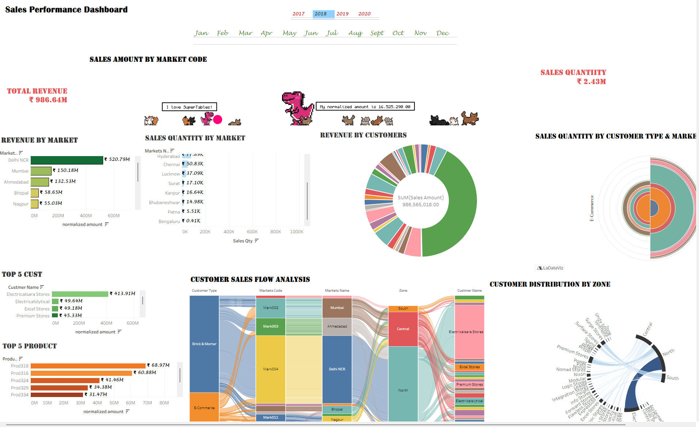
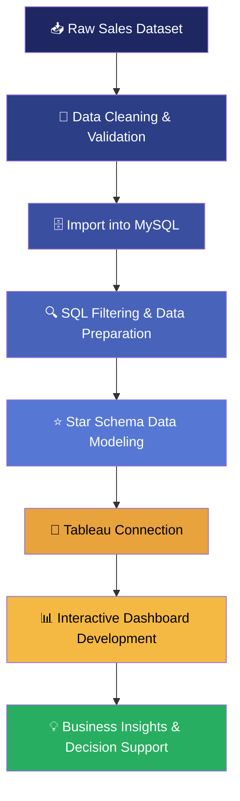

<div align="center">

# 📊 Sales Performance Dashboard

### End-to-End Business Intelligence Solution | MySQL → SQL → Star Schema → Tableau

**Turning 986M+ in raw transactional sales data into an executive decision-making system.**


</div>

---

## 📌 Executive Summary

> **This is not a chart-making exercise — it is a decision-support system.**

Retail and distribution businesses generate enormous volumes of transactional data across markets, customers, and products, but raw data by itself does not drive decisions. This project converts a raw sales dataset into a **production-style Business Intelligence pipeline** — cleaned and validated, structured in **MySQL**, modeled into a **Star Schema**, and delivered through an **interactive Tableau dashboard** that answers the specific questions a CEO, Sales Director, or Regional Manager would actually ask.

|                       |                                                                                                                                                                                    |
| --------------------- | ---------------------------------------------------------------------------------------------------------------------------------------------------------------------------------- |
| **Problem it solves** | Revenue, customer, and product performance data are scattered and hard to interpret at a glance, delaying decisions on budget allocation, account retention, and market expansion. |
| **Who uses it**       | CXOs, Sales Directors, Regional/Zone Managers, Key Account Managers, and Business Analysts who need a single source of truth for performance review.                               |
| **Why it matters**    | It replaces static spreadsheets and ad-hoc reporting with a live, filterable dashboard — reducing the time from _"what happened?"_ to _"what should we do about it?"_              |

This README documents the complete engineering and analytical workflow behind the dashboard — from raw data to executive insight — the same way it would be documented in a professional BI delivery team.

---

## 🖥️ Dashboard Preview

<div align="center">



</div>

**At a glance:** The unified dashboard surfaces **₹986.64M in total revenue** across **14 markets**, tracks sales quantity trends, ranks top customers and products, and visualizes how revenue flows from customer channel → market → zone → individual account — all on one interactive screen, filterable by year and month.

---

## 🎯 Business Problem

Organizations selling across multiple markets and customer channels typically struggle with the following recurring, high-stakes questions:

- **Revenue Concentration** — Is the business dangerously dependent on one or two markets?
- **Customer Dependency** — How much revenue rests on a single key account, and what is the retention risk?
- **Market Performance** — Which markets are worth further investment, and which are underperforming?
- **Sales Trends** — Is revenue growth genuine, or masking seasonal decline?
- **Regional Comparison** — Which zones (North, Central, South) carry the business, and which are underdeveloped?
- **Customer Segmentation** — How does performance differ between Brick & Mortar and E-Commerce channels?
- **Product Analysis** — Which SKUs are true revenue drivers versus long-tail contributors?
- **Business Decision-Making** — How can leadership move from raw numbers to specific, defensible action?

This dashboard was designed specifically to answer these questions with evidence, not intuition.

---

## 🔄 Project Workflow



Each stage exists for a reason: raw data is untrustworthy until validated, MySQL provides a queryable and auditable staging layer, SQL filtering shapes the data for analytical use, the Star Schema optimizes it for fast multi-dimensional slicing, and Tableau turns that model into something a non-technical executive can actually use to make a decision.

---

## 🛠️ Tech Stack

| Category             | Tools / Concepts                        | Purpose                                                                 |
| -------------------- | --------------------------------------- | ----------------------------------------------------------------------- |
| **Database**         | MySQL                                   | Centralized, queryable staging and storage layer for cleaned sales data |
| **Query Language**   | SQL                                     | Filtering, joins, aggregation, and data preparation prior to modeling   |
| **Data Modeling**    | Star Schema Design                      | Structuring fact & dimension tables for analytical performance          |
| **Visualization**    | Tableau Desktop                         | Interactive dashboard design and business storytelling                  |
| **BI Concepts**      | Business Intelligence, KPI Design       | Translating raw metrics into decision-ready indicators                  |
| **Dashboard Design** | Layout, Filters, Actions, Storyboarding | Executive-friendly, self-service analytics experience                   |
| **Version Control**  | Git, GitHub                             | Project versioning, documentation, and portfolio hosting                |

---

## 🔗 Data Pipeline

| Stage                    | What Happens                                                                                              | Why It Matters                                                                                       |
| ------------------------ | --------------------------------------------------------------------------------------------------------- | ---------------------------------------------------------------------------------------------------- |
| **1. Raw Data**          | Transactional sales data ingested as-is (markets, customers, products, dates, amounts)                    | Establishes the ground truth before any transformation                                               |
| **2. Cleaning**          | Null handling, duplicate removal, type correction, currency/unit standardization                          | Bad data produces confidently wrong dashboards — this step protects trust in every number downstream |
| **3. SQL (MySQL)**       | Data imported into MySQL as the analytical staging layer                                                  | Provides a queryable, auditable, repeatable environment instead of static spreadsheet files          |
| **4. Filtering**         | SQL queries used to scope, join, and prepare relevant fields (customers, markets, products, transactions) | Reduces noise and ensures only business-relevant, correctly-typed data reaches the model             |
| **5. Star Schema**       | Fact table (transactions) linked to dimension tables (customers, markets, products, date)                 | Enables fast, flexible slicing by any business dimension without redundant data                      |
| **6. Relationships**     | Primary/foreign key relationships established between fact and dimension tables                           | Guarantees referential integrity and accurate cross-dimensional aggregation                          |
| **7. Dashboard**         | Star Schema connected to Tableau; worksheets and dashboards built on top                                  | Converts a data model into a visual, interactive decision-making tool                                |
| **8. Business Insights** | Dashboard interpreted into insights, recommendations, and decisions                                       | The actual point of the entire pipeline — action, not just visualization                             |

---

## ⭐ Data Model

The dashboard is powered by a **Star Schema**, the industry-standard model for analytical (OLAP-style) workloads, chosen deliberately over a flat table for performance and scalability reasons.

**Fact Table**

- `transactions` — the numeric, transactional core of the model: `Sales Amount`, `Sales Qty`, `normalized amount`, `Order Date`, and foreign keys to every dimension.

**Dimension Tables**

- `customers` — Customer Name, Customer Code, Customer Type (Brick & Mortar / E-Commerce)
- `markets` — Markets Code, Markets Name, Zone
- `products` — Product Code, Product Type
- `date` — Calendar attributes (Year, Month Name, Date Yy Mmm) enabling time-based trend analysis

**Relationships**
Each dimension table connects to the `transactions` fact table via a shared key (Customer Code, Market Code, Product Code, Order Date), allowing any measure to be sliced by any combination of customer, market, product, or time — without duplicating data.

**Why this matters:**

| Benefit                   | Impact                                                                                                                                                                        |
| ------------------------- | ----------------------------------------------------------------------------------------------------------------------------------------------------------------------------- |
| **Query Performance**     | Star Schema joins are simpler and faster than a fully normalized (snowflake) model, keeping SQL aggregation fast even as data grows                                           |
| **Dashboard Performance** | Tableau performs significantly better against a star-shaped model, since it minimizes join complexity at render time                                                          |
| **Scalability**           | New dimensions (e.g., a `regions` or `promotions` table) can be added without restructuring existing relationships                                                            |
| **Business Usability**    | Analysts and executives can filter/cross-filter by any dimension intuitively, because the model mirrors how the business actually thinks (by customer, market, product, time) |

Tableau was deliberately connected **after** SQL preprocessing and Star Schema construction — not directly to raw data — ensuring the visualization layer always sits on top of clean, well-modeled, high-integrity data.

---

## 🧠 Skills Demonstrated

| Domain                    | Skills                                                                         |
| ------------------------- | ------------------------------------------------------------------------------ |
| **Data Engineering**      | SQL, MySQL, ETL Concepts, Data Cleaning, Data Validation                       |
| **Data Modeling**         | Star Schema Design, Fact/Dimension Modeling, Relationship Management           |
| **Business Intelligence** | Dashboard Design, Interactive Visualization, KPI Analysis, Tableau Development |
| **Analytical Thinking**   | Business Analysis, Data Storytelling, Insight Generation, Decision Support     |
| **Engineering Practice**  | Git, GitHub, Technical Documentation, Reproducible Workflow                    |

---

## ⚙️ Dashboard Features

- **Year & Month Filters** — Toggle between 2017–2020 and drill into any month to isolate seasonal effects.
- **Cross-Filtering** — Selecting a market, customer, or product dynamically filters every other worksheet on the dashboard.
- **Market Selection** — Drill from national totals into individual market performance (e.g., Delhi NCR, Mumbai, Ahmedabad).
- **Customer Analysis** — Identify and isolate top accounts to evaluate concentration and dependency risk.
- **Dynamic, Story-Driven Layout** — Each worksheet is positioned to answer one business question, so the dashboard reads like a business narrative rather than a wall of charts.
- **Multi-Level Flow Visualization** — Sankey-based views trace revenue and volume from channel type down to individual customer, something a standard bar chart cannot show.

---

## ❓ Business Questions Answered

| Business Question                               | Visualization                                         | Business Value                                         | Decision Supported                                      |
| ----------------------------------------------- | ----------------------------------------------------- | ------------------------------------------------------ | ------------------------------------------------------- |
| Which markets generate the highest revenue?     | Revenue by Market (bar chart)                         | Reveals revenue concentration across 14 markets        | Prioritize investment in Delhi NCR, Mumbai, Ahmedabad   |
| How much product is moving through each market? | Sales Quantity by Market (bar + pictogram)            | Distinguishes revenue value from operational volume    | Align logistics & warehousing capacity with demand      |
| Who are our highest-value customers?            | Top Customers (bar) + Revenue Share (donut)           | Quantifies customer concentration risk                 | Prioritize retention strategy for key accounts          |
| Which products contribute most to sales?        | Top Products by Revenue (bar)                         | Identifies true revenue-driving SKUs                   | Guide production, pricing, and promotion focus          |
| How has revenue trended over time?              | Monthly Revenue Trend (line chart)                    | Separates seasonal fluctuation from structural decline | Build accurate rolling forecasts and time promotions    |
| How does revenue flow from channel to customer? | Customer Sales Flow (Sankey)                          | Traces multi-stage value flow across dimensions        | Strengthen channel and hub-market strategy              |
| How does volume differ by channel and market?   | Sales Quantity by Customer Type & Market (polar area) | Compares channel maturity across markets               | Balance investment across Brick & Mortar and E-Commerce |
| How are customers distributed across zones?     | Customer Distribution by Zone (radial Sankey)         | Highlights regional account concentration              | Expand coverage in underdeveloped zones (e.g., South)   |

_(Business questions and framing are drawn directly from the project's executive presentation and analysis.)_

---

## 🖼️ Dashboard Gallery

### 1. Revenue by Market


- **Business Question:** Which markets generate the highest revenue for the business?
- **Explanation:** A sorted horizontal bar chart ranking all 14 markets by normalized revenue.
- **Business Value:** Makes revenue concentration immediately visible without requiring the viewer to read a table of numbers.
- **Key Insight:** Delhi NCR alone contributes ₹520.79M — over half of total company revenue — while the bottom eight markets combined contribute less than Ahmedabad alone.
- **Decision Supported:** Directs marketing and inventory investment toward the top three markets and flags weak markets for review.

---

### 2. Sales Quantity by Market


- **Business Question:** How much product is actually moving through each market?
- **Explanation:** A companion bar chart measuring unit volume rather than revenue, so operational load can be assessed independently of price.
- **Business Value:** Prevents the mistake of equating high revenue with high operational demand.
- **Key Insight:** Delhi NCR moves ~989.9K units — more than 2.5x Mumbai — while Nagpur and Kochi post similar volumes despite very different revenue tiers.
- **Decision Supported:** Informs warehousing, staffing, and distribution capacity planning per market.

---

### 3. Top 5 Customers


- **Business Question:** Who are our highest-value customers?
- **Explanation:** A ranked bar chart of customer accounts by total revenue contribution.
- **Business Value:** Surfaces exactly which relationships the business cannot afford to lose.
- **Key Insight:** A single account, Electricalsara Stores, contributes ₹413.91M — roughly 42% of total company revenue.
- **Decision Supported:** Justifies dedicated senior account management and a customer diversification strategy to reduce dependency risk.

---

### 4. Revenue by Customers (Share View)


- **Business Question:** How concentrated is our revenue among our customer base?
- **Explanation:** A donut chart visualizing each customer's proportional share of ₹986.56M in total sales revenue.
- **Business Value:** Communicates concentration risk more intuitively than a ranked list — the dominant slice speaks for itself.
- **Key Insight:** Electricalsara Stores' slice visibly dwarfs the next largest accounts (Excel Stores, Electricalslytical, Premium Stores — each under ₹50M).
- **Decision Supported:** Supports the case for building tiered account strategies for the next 5–10 high-potential customers.

---

### 5. Top 5 Products


- **Business Question:** Which products contribute the most to overall sales revenue?
- **Explanation:** A ranked bar chart of product codes by normalized revenue contribution.
- **Business Value:** Directs merchandising and production focus toward genuinely high-performing SKUs.
- **Key Insight:** Prod318 (₹68.97M) and Prod316 (₹60.88M) are clear top performers, together contributing more than the next four products combined.
- **Decision Supported:** Prioritizes production capacity and marketing spend on proven top performers while flagging lower-tier SKUs for review.

---

### 6. Revenue Trend by Year


- **Business Question:** How has revenue trended over time, and is growth sustainable?
- **Explanation:** A monthly time-series line chart spanning October 2017 onward, tracking normalized revenue.
- **Business Value:** Separates genuine seasonal cycles from structural risk, which a single-period snapshot cannot do.
- **Key Insight:** Revenue peaked early at ₹42.52M, has since fluctuated in a softening pattern, and the most recent data point (₹14.71M) is the lowest on record.
- **Decision Supported:** Triggers investigation into the latest decline and supports building rolling, seasonality-aware forecasts.

---

### 7. Customer Sales Flow Analysis


- **Business Question:** How does revenue flow from customer type, through markets, down to individual accounts?
- **Explanation:** A multi-stage Sankey diagram tracing flow across Customer Type → Market Code → Market Name → Zone → Customer Name.
- **Business Value:** Reveals structural relationships that no single bar chart or table could expose.
- **Key Insight:** Both Brick & Mortar and E-Commerce channels funnel heavily through Delhi NCR and the North/Central zones before converging on the same dominant customer account.
- **Decision Supported:** Supports strengthening both channel strategies around the Delhi NCR hub and protecting the Electricalsara Stores relationship.

---

### 8. Customer Distribution by Zone


- **Business Question:** How are our customer accounts geographically distributed across zones?
- **Explanation:** A radial Sankey diagram connecting dozens of individual customer accounts to their respective zones (North, Central, South).
- **Business Value:** Condenses a many-to-few relationship into one compact, comparably-scaled visual.
- **Key Insight:** The North zone — led decisively by Electricalsara Stores — and Central zone together account for the vast majority of customer-account flow, while the South zone shows a visibly thin, underdeveloped band.
- **Decision Supported:** Supports expanding account acquisition efforts in the South zone and right-sizing regional sales team coverage.

---

> **Note:** One additional worksheet in this project's screenshot set was not identifiable from the exported filename at the time of writing this README (its name was obscured in the source screenshot). Once confirmed, it should be added to this gallery following the same format above.

---

## 💡 Key Business Insights

1. Total company revenue across the analyzed period stands at **₹986.64M**, generated across **14 markets** and **20+ customer accounts**.
2. **Delhi NCR** is the single largest market, contributing **₹520.79M** — over half of total company revenue — making it the primary growth engine of the business.
3. Revenue follows a **long-tail distribution**: the top 3 markets generate the overwhelming majority of revenue, while the bottom 8 markets combined contribute less than the third-largest market alone.
4. **Sales volume and revenue rankings are not identical** — Nagpur, for example, outranks Ahmedabad in units sold despite trailing significantly in revenue, suggesting a pricing or product-mix difference worth investigating.
5. **Electricalsara Stores** represents a significant customer concentration risk, contributing approximately **42% of total revenue** on its own.
6. The next nine largest customer accounts, combined, contribute **less revenue than Electricalsara Stores alone** — reinforcing the need for account diversification.
7. Product revenue is led by two clear standouts, **Prod318 and Prod316**, which together contribute more than several lower-tier products combined.
8. Product performance tapers off **gradually rather than sharply**, indicating a reasonably healthy long-tail product catalog rather than dependence on a single SKU.
9. Monthly revenue shows a **recurring peak-and-trough pattern**, consistent with seasonal demand cycles rather than random noise.
10. The most recent monthly data point marks the **lowest revenue value in the entire tracked period**, a signal that warrants proactive investigation rather than being dismissed as normal variation.
11. Both **Brick & Mortar and E-Commerce** channels route disproportionately through the same top markets and zones, indicating shared infrastructure dependency across channels.
12. The **North and Central zones** account for the substantial majority of customer-to-zone flow, while the **South zone is significantly underdeveloped**, representing a clear expansion opportunity.
13. The **Star Schema data model** enables all of the above insights to be generated through simple, fast, cross-filterable Tableau interactions rather than manual spreadsheet analysis.
14. Because the dashboard is filterable by **year and month**, the same insights can be reproduced and monitored on a rolling basis rather than as a one-time analysis.
15. Collectively, these insights point to a business that is **highly capable but structurally concentrated** — in one market, one customer, and two zones — making diversification the single most important strategic theme to emerge from this analysis.

---

## 📁 Repository Structure

```
SALES-PERFORMANCE-DASHBOARD/
│
├── dashboard/                                  # Tableau workbook and dashboard source files
│
├── documentation/                              # Executive presentation & detailed report
│
├── screenshots/                                # Dashboard & worksheet exports used in this README
│   ├── customer distribution by zone.png
│   ├── customer sales flow analysis.png
│   ├── dasbord.png
│   ├── revenue by customers.png
│   ├── revenue by market.png
│   ├── revenue by year.png
│   ├── sales quantity by market.png
│   ├── top 5 cust.png
│   └── top 5 product.png
│
├── .gitignore
└── readme.md
```

> ℹ️ Filenames above reflect the project's actual `screenshots/` folder. One file in the folder had a name obscured by an overlapping tooltip in the source screenshot — please verify and update that entry before publishing if it represents a distinct visualization not already listed in the Gallery.

---

## 📚 Documentation

This project includes two supporting documents beyond this README:

| Document                                | Contents                                                                                                                                                                                                    |
| --------------------------------------- | ----------------------------------------------------------------------------------------------------------------------------------------------------------------------------------------------------------- |
| **Executive Presentation (PowerPoint)** | A business-question-driven walkthrough of the dashboard — each slide poses one executive-level question and answers it using a specific Tableau visualization, along with insights and supported decisions. |
| **Detailed Report (PDF)**               | An in-depth written record of the analysis: methodology, data preparation steps, modeling decisions, and expanded commentary on each business finding.                                                      |

Both documents live in the `documentation/` folder and are intended to let a reviewer understand the full analytical narrative without opening Tableau.

---

## 🚀 How to Use

1. **Open the Tableau Workbook** — Launch the `.twbx` file inside the `dashboard/` folder using Tableau Desktop (or Tableau Reader for a read-only view).
2. **Apply Filters** — Use the Year (2017–2020) and Month filters at the top of the dashboard to scope the analysis to a specific period.
3. **Interact with the Dashboard** — Click on any market, customer, or product to cross-filter every other worksheet and drill into that specific segment.
4. **Explore the Flow Diagrams** — Hover over the Sankey and radial Sankey visuals to inspect exact flow values between customer type, market, zone, and account.
5. **Read the Documentation** — Refer to the PowerPoint and PDF in `documentation/` for the full business narrative behind each visualization.

---

## 🔮 Future Enhancements

- **Forecasting** — Layer in trend/forecast lines (e.g., exponential smoothing) directly within Tableau to project future revenue.
- **Python-Based ETL** — Replace manual SQL preparation steps with a scripted, repeatable Python ETL pipeline (pandas / SQLAlchemy).
- **Cloud Deployment** — Migrate the MySQL layer to a managed cloud database (e.g., Azure SQL, Amazon RDS) for scalability and remote access.
- **Tableau Public Hosting** — Publish an anonymized version of the dashboard to Tableau Public for live, recruiter-accessible interaction.
- **Real-Time Dashboards** — Integrate a streaming or scheduled-refresh data source for near-real-time performance monitoring.
- **Machine Learning & Predictive Analytics** — Extend the model with customer churn prediction and demand forecasting to move from descriptive to predictive BI.

---

## 🎓 Learning Outcomes

This project demonstrates practical, end-to-end ownership of a Business Intelligence deliverable, including:

- Designing and executing a **full BI pipeline** from raw data to executive dashboard, not just building charts in isolation.
- Applying **SQL and MySQL** to clean, filter, and prepare real-world transactional data for analytical use.
- Designing a **Star Schema** data model and understanding why it outperforms flat or over-normalized alternatives for BI workloads.
- Translating a data model into a **business-question-driven Tableau dashboard**, rather than a generic collection of charts.
- Practicing **data storytelling** — connecting every visualization back to a specific business question, insight, and decision.
- Producing **professional technical documentation** (this README, an executive presentation, and a detailed report) suitable for stakeholder and recruiter review.

---

## 👤 Author

**[ANUBHAV CHAUHAN]**
Data Analyst | Business Intelligence Enthusiast

_If you found this project useful or interesting, consider leaving a ⭐ on the repository._

</div>
